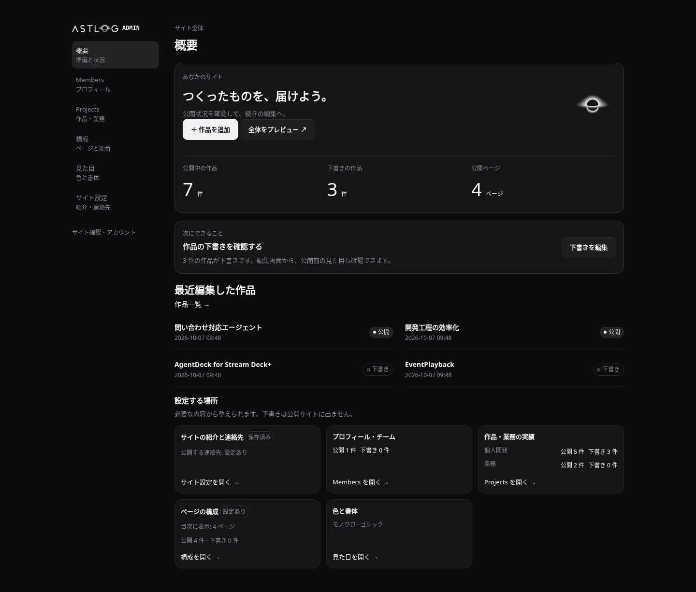
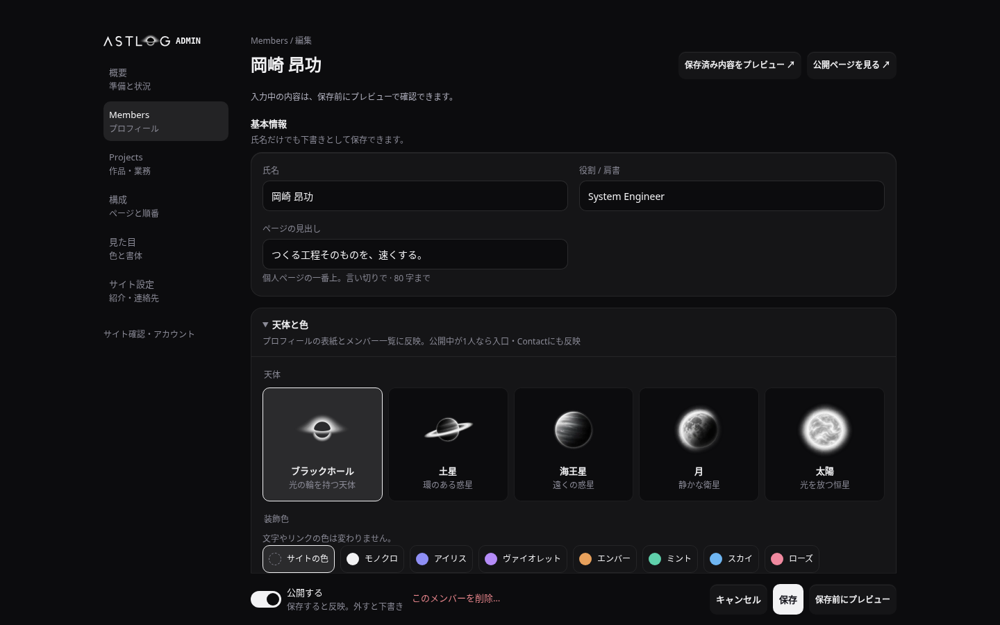
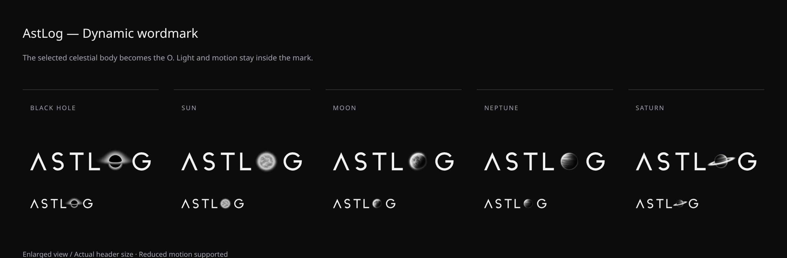
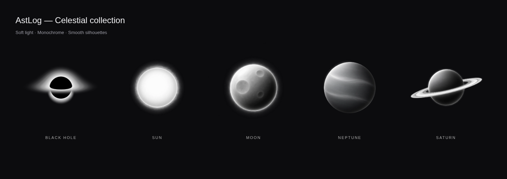

# AstLog

つくったものを置いておく場所。Cloudflare Workers の上で、公開ページと管理画面を
1つの Worker が返す。

名前は AstLog（astro ＋ log）。リポジトリ・Worker・D1・クッキーとヘッダの名前も
astlog にそろえてある。公開先は取得済みの独自ドメイン `astlog.dev`。

- 公開先: `https://astlog.dev`
- 管理画面: `https://astlog.dev/admin`

`wrangler.toml` の Custom Domain と `src/site.ts` の origin を合わせてある。
workers.dev とプレビュー URL は無効。公開はデプロイ後で、購入したドメインだけでは
サイトは動かない。Cloudflare の Custom Domain が DNS と証明書を用意する
（[公式手順](https://developers.cloudflare.com/workers/configuration/routing/custom-domains/)）。

## 構成

| 層 | 使うもの | なぜ |
| --- | --- | --- |
| 実行環境 | Cloudflare Workers | 常時起動のサーバーを持たずに済む |
| データ | D1（SQLite） | メンバーと Projects（個人開発 / 業務） |
| 画像 | KV | アバター（`avatars/`）と作品の画像（メインの画像・アイコン・ほかの画像。`items/`）だけ。R2 が未有効なので当面こちら。受けるのは中身で確かめた PNG・JPEG・WebP・AVIF・GIF だけ。ほかに写しの版の1行（`site:version`）が同居している |
| 公開ページの写し | Cache API ＋ KV の版 | 訪問者の画面は D1 に聞かずに返し、D1 が落ちても前の写しを出す（下の「公開ページの写し」） |
| 管理画面のログイン | GitHub / Google の OAuth | パスワードを持たない。本人は提供元の ID で照合する |
| 言語 | TypeScript | |
| ルーティング・描画 | Hono（JSX でサーバーサイドレンダリング） | クライアント側のフレームワークを持たない |
| DB | Drizzle ORM | スキーマは TypeScript が正、SQL は生成する |
| 書式・lint | Biome | `src/` `test/` `public/` `scripts/` を見る |
| テスト | Vitest（workerd 上で実行） | D1 も KV も本物で確かめる |
| レイアウトの検査 | Playwright（`npm run check:fit`） | はみ出し・切り取り・上の帯の貼り付け・入口のブラックホールの置き場所を実際に測る |
| 可読性の検査 | Playwright（`npm run check:contrast`） | 入口と締めの軌道図のまわりで文字が読めるかを画素で測る |

ランタイム依存は Hono と Drizzle だけ。
開発ツールの間接依存（undici・sharp・旧 esbuild loader）は、セキュリティ修正版へ
`package.json` の overrides で固定し、型・テスト・ビルドと Drizzle の schema export を確認する。**内容と導線は JavaScript なしで成立する**。
公開ページは装飾を順に動かし始める inline helper 1本だけを持ち、`<script src>` は0本。
絞り込みとページの移動は URL とサーバー、管理画面は HTML フォームと 303 で動く。
全部の応答に CSP（公開・管理 HTML は各 helper の exact SHA-256 だけ、それ以外は `script-src 'none'`）と
`X-Content-Type-Options: nosniff`・`Referrer-Policy: strict-origin-when-cross-origin`
を付ける。任意の script は許さない。管理画面は `Cache-Control: no-store`。
付けているのは `src/index.tsx` のミドルウェアと、Worker を通らない `public/` の
ファイルには `public/_headers`（決まりは `CLAUDE.md` の「応答のヘッダ」）。

公開ページは節ごとに1ページ（入口・Projects・Profile・Contact と打ち込むブロック）で、
骨格は1つ——上の帯（ロゴと目次）・本文・足元（名乗りと連絡先）。普通に縦にスクロールし、
上の帯はページの上に貼り付いてどこまで読んでも見えている。ページを移るときは CSS の
view transitions で短く切り替わる（一覧の行の題が作品のページの見出しへつながる）。行き来は目次とページの中のリンクだけで、画面の底の「← 前 / 次 →」は無い。
以前は「1画面に1つぶんを収め、ページはスクロールしない」を不変条件にして、入りきらない
ぶんを次の URL に割り、底の左右の手でめくっていたが、持ち主が実際に触って「底の左右の手で
しかめくれないのは面倒すぎる」と判断してやめた（`CLAUDE.md` の「公開ページは縦に読む」。
前の URL は新しい場所へ 301）。1ページ = 1ドキュメントで、どのページも `h1` をちょうど
1つ持ち、題も説明文も canonical もページごとに違う。
機械に読ませる口として `/robots.txt` と `/sitemap.xml` があり、どちらも
（手で並べた表ではなく）公開ページと同じ式から数え上げている。

公開中のメンバーが1人のあいだは、サイトはその人として名乗る。Team のページの代わりに
その人のプロフィール（`/members/<slug>` の1ページに名札・About・Skills・Career）がサイトの
並びに入り、目次では「Profile」の1行になる。足元はどのページでも名前と職種を出し、入口の
大見出しはその人の一文（名前ではない）。2人目を公開すると Team と器の名乗りに戻る（決まりは
`CLAUDE.md`）。

## 動かす

```bash
npm install
npm run db:migrate:local   # ローカル D1 にスキーマと選択肢（platforms）を作る
npm run db:seed:local      # 任意: 開発・画面検査用のデータと画像（ローカルの中身を入れ直す）
npm run dev                # http://localhost:8787
```

管理画面（`http://localhost:8787/admin`）に入るには、GitHub か Google の
OAuth クライアントが要る。作り方と `.dev.vars` の書き方は下の「管理画面に入る」。

## 管理画面に入る

ログインは GitHub か Google の OAuth だけ（パスワードは無い）。owner として
最初に紐づくのは、`wrangler.toml` の `[vars]` に書いたアカウントだけ。

- `OWNER_GITHUB_ID` — GitHub の**数値の**ユーザー id（ログイン名ではない。
  `https://api.github.com/users/<ログイン名>` の `id`）。いまは `118629892`
- `OWNER_GOOGLE_EMAIL` — Google アカウントのメールアドレス（Google が確認済みの
  もの。大小は無視する）。いまは管理者として指定したアドレス `iam74k4@gmail.com` を
  入れてある。**別の Google アカウントで入るなら、ここを書き換える**

そのアカウントで一度ログインすると D1 の `user_identities` に紐づき、以後は
提供元の ID（GitHub の id / Google の sub）で照合する。ログイン名やアドレスを
変えても入れる。`[vars]` の値が効くのは**値ごとに1度だけ**で、使った値は D1 の
`owner_claims` に残る（同じ確認済みアドレスを持つ別の Google アカウントも、外したあとの
同じアカウントも、その値ではもう紐づかない）。どちらにも当たらないアカウントは「このアカウントでは入れません」
（403）になり、その画面にそのアカウント自身の ID が出る——設定を間違えたときは、
それを `[vars]` に写せばよい。

### OAuth のクライアントを作る

GitHub（OAuth App。コールバック URL を1つしか持てないので、本番用と開発用の2つを作る）

1. GitHub の Settings → Developer settings → OAuth Apps → New OAuth App
2. 本番用: Homepage URL `https://astlog.dev`、Authorization callback URL
   `https://astlog.dev/admin/auth/github/callback`
3. 開発用: Homepage URL `http://localhost:8787`、Authorization callback URL
   `http://localhost:8787/admin/auth/github/callback`
4. それぞれの Client ID と、Generate a new client secret で出るシークレットを控える。
   スコープは頼まない（公開プロフィールの id だけを見る）

Google（ウェブ アプリケーションの OAuth クライアントを1つ）

現在は [AstLog プロジェクトのクライアント画面](https://console.cloud.google.com/auth/clients?project=gothic-concept-510617-g4)
にある「AstLog Admin」を使う。Google の同意画面は「テスト中」で、テストユーザーには
`iam74k4@gmail.com` を登録してある。本番 Worker の `GOOGLE_CLIENT_ID` と
`GOOGLE_CLIENT_SECRET` は Cloudflare の Secrets に保存する。管理者として通すかの判定は、
Google の設定とは別に、上の許可設定と登録済みの固有 ID で行う。

1. Google Cloud Console の「API とサービス」→ OAuth 同意画面を作る。スコープは
   `openid` と `email` だけ。公開前（テスト中）のままなら、テストユーザーに自分を足す
2. 「認証情報」→「認証情報を作成」→「OAuth クライアント ID」→ 種類は
   「ウェブ アプリケーション」
3. 承認済みのリダイレクト URI に2つ足す:
   `https://astlog.dev/admin/auth/google/callback` と
   `http://localhost:8787/admin/auth/google/callback`

開発では `.dev.vars`（コミットしない）に、開発用の値を書く。

```
GITHUB_CLIENT_ID=開発用 OAuth App の Client ID
GITHUB_CLIENT_SECRET=開発用 OAuth App のシークレット
GOOGLE_CLIENT_ID=….apps.googleusercontent.com
GOOGLE_CLIENT_SECRET=…
OAUTH_REDIRECT_ORIGIN=http://localhost:8787
```

`OAUTH_REDIRECT_ORIGIN` は開発でだけ要る。`wrangler.toml` に `routes`（astlog.dev）が
あると、`wrangler dev` は Worker に見せる URL を `http://astlog.dev/…` に書き換える
ので、リクエストから組んだコールバックが登録したもの（`http://localhost:8787/…`）と
食い違う。本番では入れない（リクエストの origin＝`https://astlog.dev` を使う）。

本番では同じ4つを secret で入れる（GitHub は本番用の OAuth App の値）。

```bash
npx wrangler secret put GITHUB_CLIENT_ID
npx wrangler secret put GITHUB_CLIENT_SECRET
npx wrangler secret put GOOGLE_CLIENT_ID
npx wrangler secret put GOOGLE_CLIENT_SECRET
```

片方の提供元だけでもよい。ログイン画面には、ID とシークレットがそろった提供元だけが出る。

### 紐づけを外す・端末を締め出す

紐づいたアカウントは、`[vars]` を書き換えても外れない（ID で照合しているため）。
外すときは D1 の行を消す。`[vars]` がそのままでも、同じアカウントで入り直して紐づき
直ることは無い（その値はもう使ってある。`owner_claims`）。

```bash
npx wrangler d1 execute astlog --remote --command "DELETE FROM user_identities WHERE provider = 'github'"
npx wrangler d1 execute astlog --remote --command "DELETE FROM sessions"
```

外したアカウントを**また使う**ときは、使った記録の行も消してから、そのアカウントで
ログインする（`[vars]` の値がそのアカウントのものであること）。

```bash
npx wrangler d1 execute astlog --remote --command "DELETE FROM owner_claims WHERE provider = 'github'"
```

別のアカウントに替えるなら、`[vars]` をそのアカウントの値に書き換えてデプロイする
（新しい値として1度だけ効く）。

ログインの入口（`/admin/auth/<提供元>/start`）は、同じ IP から 60 秒に 10 回まで
（`wrangler.toml` の `[[ratelimits]]`。作っておくものは無い）。超えると 1 分ほど 429 になる。

端末を失くした・共用の端末でログアウトし忘れたときは、管理画面の「アカウント」
（左ナビの足元の名前）→「すべての端末からログアウト」。管理画面に入れないときは、

```bash
npx wrangler d1 execute astlog --remote --command "DELETE FROM sessions"
```

## 公開する文言と連絡先を設定する

管理画面の概要（`/admin`）から、次にする設定と公開/下書きの件数を確認できる。
Members・Projects のフォームは基本情報を先に書き、本文・画像・URL・並び順などは必要なときに開く。
保存済みのメンバー・作品・ブロックは、下書きのまま管理者専用プレビューで表示を確認できる。




概要では公開/下書き件数と最近編集した作品を確認できる。作品一覧にはサムネイルと操作名を表示する。
保存操作はスクロール中も下部に残り、入力エラーは先頭の一覧から該当欄へ移れる。
同じ内容を複数のタブで編集した場合、古い版の保存は409で止めて入力を残す。「最新の編集画面と比較する」から新しいタブで最新を開き、必要な変更を反映する。
構成の数字・リンク・年表・取り組みは項目ごとに入力する。見た目は選んだ色と書体を実際の見本へ反映し、サイト設定の紹介文・問い合わせ文は複数行で編集できる。
天体の選択見本は原画から作る192pxの画像（5枚合計約34KB）。原画を差し替えたら `node scripts/export-admin-art.mjs` と `npm run format` で再生成する。
`npm run check:admin` で3寸法の主要画面、キーボード、競合、保存前プレビュー、JS無効時の操作を検証する。

各編集フォームの「保存前にプレビュー」で、入力中の文章・選んだ画像・見た目を同じ画面のダイアログに表示する。閉じると入力とフォーカスが戻る。JS無効時は別タブで開く。
保存・公開はせず、元のフォームも残る。サイト設定と見た目は入口・作品・Profile / Team・連絡先・全体から確認先を選べる。
Profile / Team は公開中が1人ならプロフィール、複数なら一覧を表示する。未保存プレビューの全体リンクは保存済み内容を別タブで開く。
全体プレビューは現在公開中のデータを使う。プレビューは認証・送り元検査・
`no-store`・`noindex` で守り、公開ページのキャッシュの版を変えない。

Members の「天体と色」は画像付きの選択肢。ブラックホール・土星・海王星・月・太陽とアクセント色を選べる。
「保存前にプレビュー」で、写真を残したプロフィールの天体を確認する。
公開中が1人なら入口と Contact の中心にも反映される。新規・未設定はブラックホールとサイトの色。
色は装飾に使い、本文の読みやすさと書体は共通のまま。
ワードマークの「O」も選んだ天体に連動する。1人のサイトでは全ページ、プロフィール・作品では公開の持ち主の天体を使い、
複数人の共通ページではブラックホールになる。保存前プレビューでも確認できる。
大きな天体にはCSSだけの動きがある。ブラックホールは中心を固定して円盤の光を流し、
太陽は球体を固定して外周の光だけを揺らす。月・海王星は浮遊し、土星は小さく傾く。
ロゴの O は光の揺らぎや小さな浮遊で動き、文字の位置・名札の記号・favicon は静止。
OSの動きを減らす設定では止まり、強制色では O を輪で描く。保存前プレビューにも同じCSSを使う。
`npm run check:celestial-motion` で5天体・PC/スマホ・保存前プレビュー・停止設定を検証する。



管理画面の「サイト設定」（`/admin/site`）でサイトの一言・入口の紹介文・Contact の案内文・
公開するメールアドレス・GitHub URL を編集する。保存した値は D1 の `settings` の `site.*` に入り、
公開ページと説明文・構造化データに反映される。メールと GitHub は空にすると掲載しない。
どちらも未設定なら Contact に「連絡先を準備しています」と出る。

空の D1 には個人のプロフィール・作品・メール・GitHub を入れない。メンバーと作品はそれぞれの
管理画面から追加する。ローカルの `seed.sql` は見本用で、本番の初期設定には使わない。
サイトの名前と公開先（`https://astlog.dev`）は `src/site.ts` のブランド・デプロイ設定として固定する。
ログインできるアカウントは公開する連絡先とは独立している。

## 確かめる

```bash
npm run typecheck # src/ と test/ の両方を見る
npm run lint      # 警告も落とす（--error-on-warnings）。直すなら npm run format
npm test          # workerd 上で D1・KV ごと動かす
npm run check:fit # レイアウト——はみ出し・切り取り・上の帯の貼り付け（ブラウザで実測）
npm run check:contrast # 軌道図のまわりで文字が読めるか（ブラウザで実測）
npm run check:restore  # deploy が残す D1 の写しを、空の D1 に戻せるか
```

`check:fit` と `check:contrast` の2つだけは毛色が違う。`npm test` は workerd の中で動くので版面を組む
エンジンが居らず、レイアウトを1行も測れない。そこで `wrangler dev` を自分で立て、
3書体 × 3ビューポート（390x844 / 768x1024 / 1440x900。電話と板の2つは指＝
`pointer: coarse` で）× 訪問者とログインした姿（上の帯に「管理画面」が出る）×
`/sitemap.xml` に載った全 URL を Chromium で開いて測る。`/all` は帯を貼り付けない1本の
文書なので、横に動かないことだけを 3書体 × 3寸法で測る。
初回は実体のブラウザが要る（Node は 22.18 以降。名前の上限を `src/blocks.ts` から
そのまま読むのに、Node の型の読み飛ばしを使う）。

測るのは箱の位置そのもの——`html` / `body` がページを止めていないか（`overflow` が
`visible`）、**横にはみ出さないか**（ページの `scrollWidth` と、見えている要素の左右）、
**切られた要素が無いか**（`overflow: hidden` / `clip` の祖先の外へ出た要素も、自分の字を
切っている箱も。行止めと1行で省く札と、入口と締めの星空 `.cosmos` の中——星雲を星空の箱で
切り取るのが決まり——は除く）、`h1` がちょうど1つか、上の帯が本文の上・足元が
本文の下に居るか、**帯の貼り付け**（本文の下に画面3つぶんの空きを足して一番下まで送っても
目次といまの印が画面の中にあり、帯が本文より手前に描かれ、地が透けていないか）、
**送った先**（`main` の中の id へ送ると、上端が帯の下端より下に来るか）、押す的
（目次の行き先）が `--tap` 以上か、**見出しの錨**（どのページでも節の見出しが同じ高さに居るか）、**入口の軌道図**
（ブラックホールが焦点に座って絵が読めているか）。あわせて、
**目次の印**（いまのページの行き先）が帯の見えている幅の中にあるか——帯の最初の位置は
読み込んだときに決まるので、ここだけはページごとに開き直して測る。

中身は4つで、どれも使い捨ての D1 に入れて測る（手元の D1 には触らない。migrate や
seed を先に流さなくてよい）。

| 中身 | 何か | URL |
|---|---|---|
| seed | `seed.sql`。本人のサイトそのもの | 11 |
| seed＋ブロック3本 | seed に既定の見出しのブロックを3本（いま・数字・リンク集。`fit-fixture.mjs` の `seedBlocks`）。目次の帯が溢れる、ふつうの姿 | 14 |
| fixture（複数人） | `scripts/lib/fit-fixture.mjs` が作る、重い中身のサイト。打ち込むブロック6種（長い段落・行の多い一覧・上限の見出し）・6人の Team・長い肩書き・上限の大見出し・長い紹介文と経歴・いちばん重い一覧の行（説明 100 字・実績値・タグとリンク5つずつ・担当者名・画像・アイコン・横長と正方形と寸法の分からない画像を混ぜたほかの画像。いちばん重い作品は上限の 8 枚）・長い本文・上限の作品名（一覧の行と作品のページの題） | 29 |
| fixture（1人） | 同じ中身で公開中のメンバーを1人にしたもの（Team の位置にプロフィール・足元が名前と長い職種で名乗る） | 23 |

成功行は中身ごとに1行出る。

```
✓ seed（1人のサイト）: 198 通り（11 URL × 3書体 × 3寸法 × 2姿）。横のはみ出し 0・
  切られた要素 0・h1 はどれも1つ・一番下まで送っても目次が見え、送った先は帯の下・
  ブラックホールは焦点に座る。いちばん長いページ 3239px（sans 390x844 指 /projects）。
  見出しの錨のずれ 最大 0px。目次の印 30 ページが帯の中（うち 0 ページは送って開いた）。
  /all は 9 通りとも横に動かない
```

読むのは3つ。**URL の数**（上の表より減っていたら、測れていない。検査は seed が 11 本
より少ないとき・fixture から生えるはずのページが1本でも欠けたときに自分で止まる）、
**いちばん長いページ**（どこがいちばん長いか。目次を貼り付けたまま読める長さか）、
**見出しの錨のずれ**（1px を超えたら落ちる）。「目次の印 N ページが帯の中（うち M ページは
送って開いた）」の M が 0 の中身は、帯が溢れていない（seed）。

貼り付けは、いまの中身が1画面に収まるページでも必ず試す（本文の下に空きを足して送る）。
中身しだいで「送れないから試せない」ページを作らないため。fixture の中身が公開の関門
（`publishErrors`）を通らないと、作る時点で止まる（公開できない中身を測らない）。

`check:contrast` も同じ理由でブラウザが要る。入口では
軌道の線とブラックホールの光が字のそばを通る（前の入口の月では、リード文が明るい縁に載って
**1.00:1** ——その字は背景と同じ明るさで、完全に消えていた）。4寸法（電話と板は指で）×
7アクセント（モノクロと6色）＝28通りをページごとに描き、入口（大見出し・札・リード文・一覧への
押し手・件数）と締め（Contact の1文・アドレス・「メールを送る」・GitHub）の字の行ボックスの
下の画素を読んで WCAG 1.4.3 に照らす。星系は入口も締めも初めから完成形で表示し、
星屑と天体が回り、粒が落ち、星が流れ、
ブラックホールの光が揺らぎ、星雲が漂い続けるので、その途中の3コマも同じ28通りで測る（入口 28 × 4姿 + 締め 28 × 4姿＝
224通り。途中の姿では、まだ出ていない字は測らない）。あわせて
**軌道図が出ていること**も見る（軌道の線と星屑、天体の光、ブラックホール、星雲、星空の星を別々に消した
絵との差分で、描いている画素数と、地からの離れ（明るさの差）に床を置く。床は天体の光・ブラックホールが
18/255、もともと淡い軌道の線と星屑・星雲・細かい星が 4/255。まとめて消すと、ブラックホールや星雲だけで
床を越えて、軌道が消えても通る）。成功行の下に、それぞれの「いちばん少ない」姿の画素数が出る。入口と締めの星空は字の後ろで消える
決まりなので、字の下の画素はこの検査がそのまま見張る。
**文字を消した地だけを撮る**のが肝で、合成後の画面をそのまま読むと
グリフ自身を背景として数えてしまい、どの組も 1.00:1 になって検査が意味を失う。撮った絵は CSP の
無い空のページで読む（測るページはサイトの CSP のまま。外すと、本物の CSP が止めるものまで描いた姿で緑になる）。

```bash
npx playwright install chromium   # 一度だけ
FIT_ONLY=many,solo npm run check:fit                     # 中身を絞って測る（seed / blocks / many / solo）
FIT_BASE=http://localhost:8787 npm run check:fit        # 立てっぱなしの dev に向けて測る（その D1 のまま・訪問者の姿だけ）
CONTRAST_BASE=http://localhost:8787 npm run check:contrast
```

`check:contrast` は手元の D1（`--local` の既定の置き場）をそのまま読むので、新しい
ワークツリーでは `npm run db:migrate:local` と `npm run db:seed:local` を先に通すこと。

2つとも `wrangler dev` を自分で立てる（ポートは `FIT_PORT` / `CONTRAST_PORT`。既定は
8788 / 8789）。**そのポートを誰かが使っていたら、立てずに止まる**。wrangler は
「Address already in use」ですぐ終わるのに、待つ側がそのポートの別のサーバ（別の
ワークツリーの dev や検査）の返事を受け、相手の画面を測って緑を出していたため。
いくつものワークツリーで並べて回すときは、ポートを分けること。準備ができる前に
wrangler が終わったときも同じく止まる（`scripts/lib/dev-server.mjs`）。

`check:restore` は、deploy が本番の D1 から取る写しと同じ形（定義と中身の2本）を、
使い捨ての D1（seed と check:fit の fixture と、ログインまわり・転送表の行を入れたもの）
から取り、別の空の D1 に下の「戻す」の順で流して、全部の表の全部の行・表と索引の定義・
当たった移行の記録が元と同じかを突き合わせる。手元の D1 には触らない。

push すると GitHub Actions が同じものを走らせる（`check` と `fit` の2つの job。
`check:restore` は `check` の job で）。

## 本番に出す

最初の一度だけ、器を作る。

```bash
npx wrangler d1 create astlog          # 出力の database_id を wrangler.toml へ
npx wrangler kv namespace create MEDIA   # 出力の id を wrangler.toml へ
```

2つの id は秘密ではないので、`wrangler.toml` に書いて**コミットする**。
`TO_BE_CREATED` のままだと、本番に触れる入口（deploy ワークフロー・`npm run deploy`・
`npm run db:migrate`）は `scripts/check-ids.mjs` が直し方を言って止める
（`npm run check:ids` で先に確かめられる）。check の「ビルド」（`wrangler deploy --dry-run`）
は id を見ないので、プレースホルダでも緑のまま。

OAuth のクライアントの secret も入れる（上の「管理画面に入る」）。

本番にはスキーマと選択肢だけを入れる。

```bash
npm run db:migrate    # スキーマとプラットフォームの選択肢
```

`seed.sql` はローカルの開発・画面検査専用で、本番へ流すコマンドはない。
Worker を出して `/admin` にログインしたら、サイト設定・プロフィール・作品・画像を
管理画面から登録する。公開内容の設定が済んだものから公開する。
ローカル用の作品画像は `scripts/fixtures/media/` から KV に入れ、本番の静的素材には含めない。

### 出す

ふだんは Actions の **deploy** ワークフロー（手動実行）から出す。やることは決まっていて、
選ぶものは無い。

1. main から実行しているか、`wrangler.toml` の id が入っているかを見る（違えば止まる。
   ただし main だけを通す守りは、下の environment の設定のほう）
2. check と同じ門を通す（型・lint・テスト・`check:restore`・ビルド・`check:fit`・
   `check:contrast`・`check:motion`・`check:celestial-motion`・`check:admin`・`check:media-restore`。`check.yml` をそのまま呼ぶ）
3. 本番 D1 の写し（`wrangler d1 export` の定義 `schema-<sha>.sql` と中身
   `data-<sha>.sql` の2本）と Time Travel の栞（`bookmark.json`）を取り、
   画像の実体・メタデータ・SHA-256を含む `media/` とともに、artifact `site-backup-<run id>` に残す（90日）。取得済み D1 の全画像参照と控えの一致を確かめ、欠落があれば移行前に止める
4. **マイグレーションを流す**（`wrangler d1 migrations apply --remote`。当てた移行は D1 に
   記録されていて、未適用のものだけが当たる。何も無ければ何もしない）
5. `wrangler deploy`

マイグレーションは「スキーマを変えたときだけ」ではなく**毎回**流す。`drizzle/` に
ファイルが増えていれば必ず当たる。流さずに出すと、表を足した移行（`0017` など）の
あとでは作品の画面が「no such table」で 500 になり、列を足しただけの移行（`0018` など）の
あとでは落ちずに、列の名前そのもの（`story_background`）が作品のページに字で出る——drizzle は
表と列を名指しで読み、SQLite は見つからない列の名前を文字列として読むので、前の D1 のままでは
今のコードが正しく動かない（`test/deploy.test.ts` がこの事実を確かめている）。

使う前に、リポジトリの設定を用意する。**どれも必須で、最初に deploy を実行するより前に**
済ませる（environment が無いまま実行すると、GitHub は保護の無い `production` を自動で作る。
承認も「main だけ」も、YAML ではなくこの設定が守っている）。

1. Settings → Environments → New environment で `production` を作る
2. Deployment protection rules で **Required reviewers** に自分を付ける。deploy の最後の
   job はこの environment で動くので、承認するまで本番に触れない
3. **Deployment branches and tags** を「Selected branches and tags」にし、`main` だけを
   足す。承認と同じく GitHub の側で効く——deploy.yml の「main から実行しているか」は、
   実行したブランチ自身の YAML に書いてあるので、そのブランチで消せる（分かりやすく
   止めるための1段で、守りではない）
4. `CLOUDFLARE_API_TOKEN`（対象アカウントの D1・Workers Scripts・Workers KV Storage の編集と、デプロイに必要な設定権限を持つトークン）を、この
   environment の **Environment secrets にだけ**置く。**リポジトリの secret
   （Settings → Secrets and variables → Actions → Repository secrets）には置かない**——
   そこに置くと、environment を外した workflow をどのブランチにでも書けば、承認も
   ブランチの制限も通らずに読める。前にリポジトリの secret に置いていたなら、
   environment の側に置き直してからリポジトリの側を消す
5. Settings → Branches で `main` を保護する。PR、最新の `check` / `fit` 成功、会話の解決を必須にし、管理者にも適用。強制 push と削除は禁止。1人運用のためレビュー人数は0（本番の承認は production 側）。

設定内容は `node scripts/setup-production.mjs` で表示し、`--apply` で適用できる。
GitHub 連携に Administration / Environments の書き込み権限が必要。403 の場合は設定できていない。
トークンはスクリプトに渡さず、production の Environment secrets にだけ置く。

deploy.yml の中でも、トークンは wrangler を呼ぶ step にだけ渡し（`npm ci` や action からは
読めない。deploy の job の `npm ci` は `--ignore-scripts`）、`permissions: contents: read`、
action は commit の SHA で固定してある（上げるときは `git ls-remote --tags
https://github.com/actions/<名前>` で引き直し、行末のタグ名も直す）。

続けて2回押しても並んでは走らない（2本目は1本目が終わるまで待つ）。

手元から出すなら `npm run db:migrate && npm run deploy`（どちらも先に id の番兵を通る）。
門は通らないので、先に `npm run typecheck` `npm run lint` `npm test`
`npm run check:restore` `npm run check:media-restore` `npm run check:fit` `npm run check:contrast`
`npm run check:motion` `npm run check:celestial-motion` `npm run check:admin` を自分で通すこと。
写しも自分で取る（下の「戻す」の2本の `d1 export`）。

### 公開ページの写し

訪問者（管理画面にログインしていない人）の公開ページは、そのデータセンターの Cache API に
写しを置き、次からは D1 に聞かずに返す（`src/lib/page-cache.ts`）。D1 が落ちている間も、
写しのある画面は前の姿で出る（写しの無い画面は 500）。

- **管理画面で保存すると、写しは外れる。** 保存が KV の `site:version` を新しくし、写しは
  置いたときの版と違えば使われない。ただし版の読みは KV のエッジのキャッシュ（60秒）を
  通すので、**保存から最大 60 秒ほど**、ほかの場所の訪問者には前の画面が出る。
  ログインしている自分にはすぐ見える
- **デプロイすると、写しは全部外れる**（鍵に Worker の版が入っている）
- **D1 が落ちている間に出すのは、いまの版の写しだけ。** 管理画面で何かを書いたあと
  （下書きに戻した・消した、を含む）の写しは、障害の間も出さない——取り下げた作品が
  障害のたびに戻ってくることは無い。版（KV）が読めないときも出さない。保存から 60 秒
  ほどは版の読みがエッジのキャッシュを通るので、その間だけは前の版の写しが出うる。
  すぐに全部を確実に外したいときは、デプロイし直す
- **D1 を管理画面の外から変えたら、版を自分で上げる。** D1 を手で直した・Time Travel で
  戻した、のあとに

  ```bash
  npm run site:touch   # 本番の site:version を新しくする（id の番兵を通る）
  ```

  上げ忘れても、写しは1時間で引き直される。ローカルの `db:seed:local` は最後に自分で上げる
- 写しを通ったかは応答の `x-astlog-cache`（`hit` / `miss` / `stale`）で分かる

### 戻す

コードは `npx wrangler rollback`（前の版の Worker に戻す）。D1 は戻らないので、
移行が中身や列を変えていたら、D1 も移行の前へ戻す（下の「前の版の Worker へ戻すときの
注意」）。D1 を戻したら、下記の画像復元を済ませてから `npm run site:touch`（公開ページの写しの版を上げる。上の
「公開ページの写し」）。

Time Travel で戻すのがふつう。deploy が残した artifact の `bookmark.json` の
`"bookmark"` を使う。

```bash
npx wrangler d1 time-travel restore astlog --bookmark=<bookmark>
# 栞が無ければ時刻で
npx wrangler d1 time-travel restore astlog --timestamp=2026-09-27T09:00:00Z
```

Time Travel は D1 に最初から入っていて、過去の任意の時点に戻せる（Workers の有料プランで
30日、無料で7日まで。戻すこと自体も取り消せる——restore は戻す直前の bookmark を出す）。
それより前へ戻す・別の D1 に写す（ステージングを作る・別のアカウントへ移す）なら、
artifact の写し（90日残る）を**新しい空の D1 に、定義 → 中身の順で**流す。

```bash
npx wrangler d1 create astlog-restore
npx wrangler d1 execute astlog-restore --remote --file=schema-<sha>.sql   # 表と索引・移行の記録の表
npx wrangler d1 execute astlog-restore --remote --file=data-<sha>.sql     # 行（d1_migrations の行も）
# 中身を確かめてから、wrangler.toml の database_id をこちらへ差し替えて出す
```

**1つの SQL にまとめた写し（`d1 export` を `--no-data` / `--no-schema` なしで取ったもの）は
流せない。** 写しは表を作った順に書くので、先に作った子の表（`item_links`・`item_tags`）の
行が親の `items` の CREATE TABLE より前に来て、`no such table: main.items` で止まる（D1 は
外部キーをいつも効かせる）。この手順は `npm run check:restore` が CI で毎回通している。
写しには `d1_migrations` の行も入るので、戻した D1 にはそのとき当たっていた移行が記録
されたままになる（次の deploy は、そのあとの移行だけを当てる）。

手元で写しを取るのも同じ2本。

```bash
npx wrangler d1 export astlog --remote --no-data --output=schema.sql
npx wrangler d1 export astlog --remote --no-schema --output=data.sql
```

写しにはメンバーの連絡先とログインの紐づけ（セッションの id は D1 にもハッシュでしか
無い）が入るので、置き場所に気をつけること。

**画像も一緒に戻す。** D1 / Time Travel は KV を戻さない。差し替え・削除画像は非公開の `archive/` に90日保持し、デプロイの控えにも含める。通常の画像URLからは控えを読めない。控えを作れない場合は原本を残してエラーを記録する。

D1 を復元して、`wrangler.toml` の DB が復元先を指すことを確認してから実行する。復元中は管理画面での更新を止める。

```bash
# artifact の media/ を指定する。D1 が参照する画像だけを元の公開キーへ復元し、実体のSHAを照合する
node scripts/media-backup.mjs restore --directory backup/media
npm run site:touch
```

Time Travel の時点に合う artifact が無い場合は、削除画像の控えが90日で消える前に `node scripts/media-backup.mjs export --directory backup/media` で現在の KV（控えを含む）を取り出してから同じ手順で戻す。参照画像が欠落・破損していたら、書き込む前に止まる。改修前に削除された画像や保持期限切れの画像は復元できない。
手元のバックアップにも `media-backup.mjs export` と `verify --schema schema.sql --data data.sql` を加える。
`npm run check:media-restore` がバイナリ・メタデータ・削除画像・破損拒否を検証する。

**前の版の Worker へ戻すときの注意。** 移行を流したあとの D1 の上で、その移行より前の
コードが動くと壊れるものがある。前の版へ `wrangler rollback` するなら、D1 もその版の
deploy が残した栞（その移行を流す**前**に取ったもの）まで戻す。**D1 を戻すと、その栞から
あとに管理画面で書いたものは消える**（戻す前に上の2本で写しを取っておけば、あとで手で
拾える）。戻さずに直すなら、前へ進める（直したコードをもう一度 deploy する）ほうが
何も失わない。

- `0006_oauth_identities` と `0007_hash_sessions`（パスワードのログインから OAuth へ）。
  0006 は `users` から `email` と `password_hash` の列を落とし、0007 はセッションを全部
  消す。この2本を流したあとの D1 の上で、それより前のコード（5627c08 まで。`users` を
  メールアドレスで引き、行を丸ごと読む）へ rollback すると、**管理画面はログインもできずに
  500 になる**（公開ページは出続ける）。移行と `wrangler deploy` のあいだ・deploy の失敗の
  あとも同じ姿になる。どちらも、今の版を deploy し直せば直る
- `0004_merge_apps_works`（Apps と Works を Projects に畳む構成の行の書き換え）。流した
  あとの D1 は、Projects を知らない版（それより前のコード）では作品の一覧が出ない。
  いまのコードは逆向き——0004 を流す前の D1（`apps` / `works` の行）——も Projects と
  して読めるので、移行が途中で止まっても一覧は消えない

この先、データを書き換える移行は2回のリリースに分ける（先に読む側を広げ、次に
書き換える。`CLAUDE.md` の「移行」）。

`items.slug`（作品の恒久リンク `/apps/item/<slug>`）だけは、マイグレーションでは
埋まらない。SQLite の `ALTER TABLE ADD COLUMN` は `NOT NULL` に定数の既定値を
要求し、その1つの値が既存行で重なって unique を張れないため、列は nullable で
入る。既にある作品は `slug` が `null` のまま——サイトは壊れず、その一覧の行が
押せる面にならない（題は素の字のまま、ホバーでも応えない）うえ、作品のページが
無いだけ。管理画面から一度保存すれば埋まり、一覧には
「恒久リンクなし（保存すると付く）」と出る。

`items.body`（作品の本文）・`items.image_url`（スクリーンショット）・`items.image_alt`
（その代替テキスト）はマイグレーションで入り、既にある作品は本文と代替テキストが
空、画像は無しのまま——作品のページに `figure` も本文の小節（Story）も無く、
一覧にサムネイルも出ないだけ（代わりの絵は置かない）。`seed.sql` は本文を書かない。
検査用の AppMixer 画像は `scripts/fixtures/media/` からローカル KV にだけ入れる。
本番の作品・画像・本文は管理画面から登録する。本文を書いた作品は説明の下に
小節（`#story`）を持つ。以前の `/apps/item/<slug>/story` はそこへ 301。
画像は KV の `items/` に置かれ、`/images/items/…` から出る。画像を公開するときは
代替テキストが要る。

`items.icon_url`（アイコン）と表 `item_shots`（ほかの画像。代替テキスト・寸法・並び順を
1枚ずつ）は `0017_item_shots` で入る。どちらも足すだけの移行で、既にある作品はアイコンも
ほかの画像も無いまま（作品のページは今までどおり）。前の版の Worker へ戻しても、前の版は
この列と表を読まないので壊れない。画像がメインの画像と合わせて2枚以上ある作品は、作品の
ページのギャラリー（`#screenshots`）に並べる。先頭を大きく置き、900px 以上は続きの画像を
大小の2列に配置する。狭い画面では全幅の1列。1枚ずつ番号と説明を添え、原寸を別タブで開ける。

本文のテンプレートの欄（`items.story_background` / `story_approach` / `story_highlights` /
`story_results`。背景・取り組み・工夫・成果）は `0018_item_story` で入る。足すだけの移行で、
既にある作品はどの欄も空のまま——書いてある本文（`items.body`）は Story の頭に見出しの無い
段落で出たまま変わらない。管理画面はその本文の欄を中身があるときだけ出すので、欄へ移して
空にすれば、その作品はテンプレートだけになる。前の版の Worker へ戻すと、テンプレートの欄に
書いた中身は作品のページに出なくなる（列は残る。もう一度出せば戻る）。

seed に本文が無いので、seed の `check:fit` は本文の小節を1つも測らない。本文の小節は
`check:fit` の fixture（長い本文を持つ2件。1件は作品名も上限ちょうど。テンプレートの欄を
4つとも埋めた作品・1つだけの作品・欄だけの作品）が測る。

`items.image_width` / `image_height`（画像の寸法。共有カードの `og:image:width` /
`height` と `twitter:card` の大きさと、画像そのものの縦横比に使う）は `0008_item_image_size` で入る。
既にある画像は寸法が `null` のまま——作品のページの共有カードは寸法を名乗らず、
小さい札（`summary`）になるだけ。画像を選び直して保存すれば読み取って入る。

`0009_one_fixed_block` 〜 `0010_permalinks_and_order` で入るもの。どれも既にある行を
壊さない。

- 決まった中身のブロック（hero / projects / team / contact）が二重送信で2行に
  なっていたら、0009 が種類ごとに1行へ畳む（公開中の行を先に、並びの先頭を残す）。
  そのあと 0010 が「1つだけ」の部分一意索引 `blocks_fixed_once` を張る。重複を
  残したまま索引を張ると移行ごと止まるので、この順は崩さないこと
- `items.year_from`（並べるための年）は year から DB が作る列（生成列・VIRTUAL）で、
  既にある作品にもそのまま効く。埋め直しの移行は要らない。頭が数字4桁でない年の
  作品は、一覧の最後に回る（管理画面が「並びに使われません」と知らせる）
- `item_slug_redirects` / `member_slug_redirects`（前の slug の転送表）は空で入る。
  管理画面で slug を変えた日から、前の URL がいまの URL へ 301 で寄る
- `form_key`（追加のフォームの一度きりの札。members・items・blocks）は既にある行では
  `null` のまま（札を持たない行は何行でも入る）

`0013_halfwidth_year` 〜 `0016_owner_claims_backfill` で入るもの。

- 0013 は作品の年（`items.year`）の全角の数字を半角に直す。年の欄を保存するときに半角へ
  直すより前に「２０２４」と保存した作品は、並べる年（`year_from`）が無く一覧の最後に
  落ちていた。数字以外の字には触らない
- 0014 は owner（`users.role = 'owner'`）が2人いる D1 を、いちばん古い1人に寄せる
  （もう1人の紐づけとセッションを移してから消す。どちらのアカウントでも同じ1人として
  入れる）。そのあと 0015 が「owner は1人」の部分一意索引 `users_one_owner` を張る。
  この順は崩さないこと（2人のまま索引を張ると移行ごと止まる）
- 0015 は `owner_claims`（`[vars]` の値を使った記録）も作り、0016 が、既に owner に
  紐づいているアカウントの記録を書き戻す（GitHub は id、Google は紐づけたアドレス）

受け取る画像は中身の先頭のバイトで決めた PNG・JPEG・WebP・AVIF・GIF だけで、
SVG と HEIC は弾く。この検査より前に上げた SVG / HEIC が KV に残っていても、
`/images/*` は画像としてではなく添付（`application/octet-stream`）で返すので、
そのアバター・作品の画像は壊れて見える。管理画面から画像を選び直せば直る
（前の画像はそのとき KV から消える）。

パスワードのログインから OAuth へ移す移行（`0006_oauth_identities` と
`0007_hash_sessions`）を当てると、`users` からメールアドレスとパスワードの
ハッシュが外れ、ログイン中のセッションは全部消える（セッションの id を D1 には
ハッシュで置くようになったため）。owner の行は id もメンバーとの紐づけもそのまま
残り、`[vars]` と一致するアカウントで最初にログインしたときに、その行へ紐づく。
前に入れた `SETUP_TOKEN` はもう使わないので `npx wrangler secret delete SETUP_TOKEN`
で消してよい。この2本は前のコードが読む列を同じリリースで落とすので、流したあとで
前の版へ戻すときは、上の「前の版の Worker へ戻すときの注意」を読むこと。

プラットフォームの選択肢（`platforms`）は `0011_platforms_reference` が入れる
（`INSERT OR IGNORE`。前に seed で入った行・運用で直した表示名や並び順は書き換えない）。
`seed.sql` はもう platforms に触らない。

`0012_item_indexes` は索引だけを張り替える（行には触らない）。公開の一覧の3つの
引き方（全部・区分・担当）に、公開の並び（`year_from` の新しい順 → 並び順 → id）の
順の索引を1本ずつと、タグ・リンクの作品ごとの索引。一覧が、公開中の全件を並べ直して
（TEMP B-TREE）から読む形から、索引の順のまま読む形になる（入れた日は1画面2件ずつ
引いていて、200 件で約 1,200 行 → 24 行だった。いまの一覧は全件を1ページに引く）。
並び（`src/db/queries.ts` の `itemOrder`）を
変えるときは、この索引も一緒に変えること（`test/queries.test.ts` の「索引」が
EXPLAIN QUERY PLAN で並べ直しが無いことを見ている）。

## 画面

どんな画面があり、どう行き来するかは `docs/` にまとめてある。

- [docs/screens.md](./docs/screens.md) — 画面一覧（公開のページと管理画面。URL・認証・出す条件・状態）
- [docs/flow.md](./docs/flow.md) — 画面遷移図

## どこに何があるか

```
src/
  index.tsx          入口。応答のヘッダ（CSP など）を全部に付け、ルートを束ねて 404 / 500 を出す
  site.ts            ブランド・公開先と、サイト設定の初期値・検査
  theme.ts           見た目のプリセット。選べる値はここが正
  domain.ts          作品の区分（ITEM_KINDS: データの値・URL の語・呼び名の対応）と、
                     UI と DB が共有する作品の型（ItemView・ItemFilter）
  blocks.ts          置けるブロックの種類。ここが正。
                     公開ページに出るか（blockShown。公開ページと管理画面の「出る / 出ない」が読む）、
                     個人ページの中身の開き方（memberUnits）、名前の長さの上限と公開の関門も
  env.ts             バインディングの型
  db/
    schema.ts        テーブル定義。ここが正
    queries.ts       公開ページが読む問い合わせと、構成・見た目・サイト設定の読み書き
  lib/
    auth.ts          セッション（D1 にはハッシュで置く）と、通してよいアカウントの判定
    oauth.ts         GitHub / Google との約束（認可 URL・トークンの交換・id_token の検査）
    format.ts        テキストの解釈とフォーム値の受け取り（と、配列を束に分ける chunk）
    page-cache.ts    公開ページの写し（Cache API）と、その版（KV の site:version）の上げ方
    sequence.ts      サイトのページの並びから目次と印を組む（tableOfContents。重なりは例外）
    orbits.ts        入口と締めの軌道図の形（件数から軌道と天体と動き続けるものを置く orbitMap・
                     軌道の奥と手前の半分 orbitHalves・見る角度 ELEVATION と傾き TILT・まわりの星空 cosmosMap と
                     星雲の塊 nebulaMap・入口と締めの枠 HERO_FRAME / CONTACT_FRAME）
  routes/
    public/          公開ページ
      routes.ts      URL の登録だけ（登録順の決まり。catch-all は最後）
      data.ts        サイトの今の姿（1人か・一覧への1本・絞り込みの読み方と効くページ）
      meta.ts        題・説明文・構造化データの組み方
      site.ts        サイトのページの並び（構成をブロック1つ＝1ページにし、目次の行に写す）
      blocks.tsx     ブロック1つを節に描く（renderBlock）
      page.tsx       サイトの1ページを描く（screenPage）・転送（movedTo）・管理画面への入口
      top.tsx        トップのページ（/ と /:screen）と全体ページ（/all）
      member-page.tsx  個人ページの中身（名札・About・Skills・Career）と URL
      member.tsx     個人ページ（/members/:slug）と前の続きの URL の転送
      item.tsx       作品1件の恒久リンク（本文の小節つき）と前の本文の画面の転送
      crawl.ts       /robots.txt・/sitemap.xml
      images.ts      /images/*（KV の画像。キーの形の検査と配るときのヘッダ）
    admin/           管理画面（/admin/*）
      index.ts       組み立て（送り元の検査 → ログインの往復 → 認証の壁 → 資源ごと）
      session.ts     送り元の検査（sameOrigin）と認証の壁（requireAuth）
      request.ts     要求の読み方（id・並び順・slug・札）と保存の知らせ
      auth.tsx       ログインの往復（/admin/login・/admin/auth/*・ログアウト）
      dashboard.tsx  概要・設定の状態と次の一手（閲覧だけ）
      preview.tsx    管理者専用の保存済み/保存前プレビュー（保存しない）
      block-preview.tsx 構成の入力中の内容を検査して表示（保存しない）
      images.ts      画像の取り込み（pickImage / putImage）と KV・D1 の順序
      members.tsx    Members
      items.tsx      Projects の項目（個人開発・業務）
      blocks.tsx     構成
      appearance.tsx 見た目
      site-settings.tsx 公開する文言と連絡先
      account.tsx    アカウント
  ui/
    Layout.tsx       公開ページの外枠（上の帯・本文・足元）
    AdminLayout.tsx  管理画面の外枠
    AdminDashboard.tsx 概要の設定案内と状態
    PreviewLayout.tsx プレビューの案内と公開ページの外枠
    AdminForm.tsx    管理画面のフォームの部品（欄・公開のトグル・確認）
    AdminVisuals.tsx 天体の選択・ブロックの見本・表示位置の案内
    AdminBlockFields.tsx ブロックの項目別入力
    admin-behavior.ts 保存前プレビューと見本の最小補助・CSPの固定ハッシュ
    admin-art.ts    管理用の縮小画像の版（export-admin-art が生成）
    components.tsx   画面を組む部品。main の直接の子は Screen / Hero だけが作る
                     外枠はどれも HtmlDocument で <html> を開く（DOCTYPE を出す）
    icons.tsx        インライン SVG（ロゴの Wordmark / HoleMark もここで描く）
    celestial.ts     メンバーの天体・色の選択肢、入力検査と安全な既定値
    logo.ts          ロゴの形と素材に焼く色の正（ΛSTLOG の O はブラックホールの絵
                     BLACKHOLE_ART。軌道図の真ん中も同じ1枚。JSX を持たない）
    motion.ts        装飾を順に動かし始める helper と、それだけを許可する CSP の SHA-256
public/
  app.css            全画面のスタイル。値は :root のトークンだけで決める
                     色・書体のプリセットもここ（[data-accent] / [data-typeface]）
                     末尾の「ページの外枠」が表紙の高さと貼り付く上の帯を作る。
                     ページを移るときの切り替え（@view-transition）もここ
  admin.css          管理画面だけの規則。管理画面は app.css のあとにこれを読み、
                     公開ページは読まない（:root は持たず、app.css の段を読む）
  preview.css        管理プレビューの案内。公開の部品は app.css を使う
  _headers           静的なファイルに付けるヘッダ（Worker を通らないので、ここで付ける）
                     Workers Static Assets が読む規則で、ファイルとしては配られない
                     3枚の CSS とブラックホール・星雲の絵は 1年・immutable（中身の版つきの URL
                     /app.css?v=… などで読むので、変えてデプロイすれば URL が変わる）
  assets/            共有ブラックホールの透過素材（blackhole.webp。0b42d90 の旧デザインを復元）。
                     GitHub の Organization の顔（astlog-avatar.png）は scripts/blackhole/render.py の avatar。
                     星雲の透過 WebP（nebula-{iris,violet,ember,mint,sky,rose}.webp。1800×1000）——
                     scripts/nebula/render.mjs が焼く。mono と iris は同じ1枚を使う。
                     favicon（favicon.svg・favicon-32.png・apple-touch-icon.png）とページの外で使う
                     ワードマーク（astlog-wordmark.svg）——scripts/logo/export.mjs が src/ui/logo.ts と
                     その絵から書く。サイトの共有カードにも astlog-avatar.png を使う。
                     ※ ここに robots.txt や sitemap.xml を置かないこと。
                       public/ は Worker より先に配られるので、置くと
                       Worker が組み立てているほうが静かに届かなくなる
scripts/
  check-fit.mjs      npm run check:fit の中身。ブラウザでレイアウトを測る（seed と、上限ちょうどの fixture）。
                     入口のブラックホールが焦点に座るかも測る
  check-contrast.mjs npm run check:contrast の中身。軌道図のまわりの文字を画素で測る
  check-admin.mjs   3寸法の管理画面・実フォーム・競合・プレビュー・縮小画像を検証
  check-media-restore.mjs 削除画像の控えと復元の実証
  media-backup.mjs  KV画像・メタデータの控え、D1の写しとの照合、復元
  setup-production.mjs production環境とmain保護の設定内容・適用
  export-admin-art.mjs 原画から管理用の縮小画像を生成
  check-restore.mjs  npm run check:restore の中身。deploy の写し（定義と中身の2本）を空の D1 に戻して突き合わせる
  check-ids.mjs      本番に触れる前の番兵。wrangler.toml の id がプレースホルダなら止める
  seed-local.mjs     ローカルにだけ検査用のデータと画像を入れる
  fixtures/media/    検査用の作品画像とプロフィール素材。本番には配らない
  touch-site.mjs     公開ページの写しの版を上げる（npm run site:touch / db:seed:local の最後）
  blackhole/         render.py。旧素材との比較用の物理レンダー（numpy と Pillow）。hero は
                     dist/blackhole-physical.webp に書き、配信中の素材を上書きしない。
                     avatar は従来どおり GitHub の顔を public/assets に書く
  logo/              export.mjs。ロゴの素材（SVG と favicon・iPhone のホーム画面の PNG）を src/ui/logo.ts
                     から書く（node scripts/logo/export.mjs。SVG は O の絵を小さくして data URI で
                     抱える。PNG は Playwright の Chromium で撮る）
  nebula/            render.mjs。nebulaMap と app.css の色・4層の濃さから星雲6枚を焼き、
                     SHA-256 の頭8桁を使った CSS の素材 URL（?v=…）も更新する
  moon/              前の入口の月（記録として残す。いまのサイトでは使っていない）。
                     render.py が Blender で焼き、pack.py が配信用に詰めていた（docs/moon.md）
  lib/               check-fit と check-contrast の共通部分。dev サーバの立て方と使い捨ての D1（dev-server.mjs）、
                     src/theme.ts の読み方（theme.mjs）、設計サイズ（viewports.mjs）。写しを2本持たない
                     wrangler.toml の id の読み方（wrangler-ids.mjs）も
                     fit-fixture.mjs は check:fit の上限ちょうどの中身を src/blocks.ts の
                     上限から作る。ts-import.mjs は src/ の .ts を Node からそのまま読む口
.github/workflows/
  check.yml          push と PR ごとの門。deploy からも同じものを呼ぶ（workflow_call）
  deploy.yml         本番へ出す道（main だけ・門 → 写し → 移行 → deploy）
drizzle/             生成されたマイグレーション（手で書かない）
test/                workerd 上で動くテスト
docs/                画面一覧と画面遷移図
seed.sql             ローカルの開発・画面検査用の見本（全部消してから入れ直す。本番へは流さない）
```

書き方の約束は `CLAUDE.md` に置いてある。

### 共有ブラックホール素材の更新



`blackhole.webp` は `0b42d90` の旧デザインを復元した透過素材（SHA-256: `c48dd421`）。
滑らかな白い光と黒い影を基準に、ほかの天体も光が暗部へ溶ける質感に揃える。
太陽の淡いガスの流れ、月の自然な濃淡、惑星の大気の帯は残し、細かな模様の主張を抑える。
ブラックホールを選んだ表紙・入口・Contact・ロゴの O は
`src/ui/logo.ts` の `BLACKHOLE_ART` から同じ1枚を読む。

1. ブラックホールを復元する場合は `git show 0b42d90:public/assets/blackhole.webp` から取り出す。
   太陽・月・海王星・土星は、この旧ブラックホールを暗い背景に重ねた参照画像から
   image_gen（`transparent_background=true`）で個別に生成した素材。白〜灰色、滑らかな陰影、
   柔らかな縁の光を使う。表面を均一な球や幾何学的な穴に単純化せず、自然な広い濃淡を残す。
   写真のような細かい粒状感や鋭い輪郭は抑え、土星の輪もにじむ白い光の帯にする。
   天体の本体が約半幅（土星は輪が約8割幅）に収まるよう余白をとった1254×1254の
   WebP（quality 88）で `celestial-*-v2.webp` に保存し、`src/ui/celestial-art.ts` の版も更新する。
2. 実ファイルの幅・高さ・中央の影の半径を `BLACKHOLE_ART` の `width`・`height`・`shadow` に
   合わせ、`src` の `?v=` をそのファイルの SHA-256 の頭8桁に更新する。
   alpha 約2%の可視光域を実測し、`lightWidth`（横幅）と `LIGHT_REACH`（影半径に対する
   上下の広がり）も合わせる。透明な余白を光の幅として数えない。
3. `node scripts/logo/export.mjs` でワードマーク・favicon・Appleアイコンも更新し、
   小さいロゴと入口・Contact・表紙の焦点、影、光の広がりを確認する。

`python3 scripts/blackhole/render.py hero` は比較用の物理レンダーを `dist/` に書く。
配信素材の再生成には使わない。GitHub の顔は従来の `avatar` 出力を使う。

星雲の形（`src/lib/orbits.ts` の `NEBULA_LOBES`）、色（`app.css` の `--nebula-a` / `-b` / `-c`・
`--ink`・`--bg`）、4層の濃さ（`--nebula-light` / `-cloud` / `-veil` / `-dust`）を変えたら、
`node scripts/nebula/render.mjs` で素材と URL の版をそろえて更新する。生成には Playwright の
Chromium が要る（初回は上の `npx playwright install chromium`）。元の3600×2000の形と模様を
1800×1000の透過 WebP へ焼き、ページでは完成形の箱ごと漂わせる。形・色・濃さの正は
既存の TS / CSS に置き、配信ページでは大きなノイズのフィルタを計算しない。
底のフェードも星空全体への mask ではなく、下端の帯だけに静止した地の色を重ねる。
瞬く星と流星は小さい HTML の点・筋を動かし、星空全体を描き直す処理を避ける。

吸い込まれる粒と流れる星は小さい HTML を動かす。65点を元にした固定 CSS 座標の各区間を
整数の1/60秒へそろえ、区間ごとの `steps()` で位置と濃さを60回/秒（`MOTION_RATE`）まで更新する。
星屑・天体・瞬きはその6刻みの100ms（`TICK` / `BODY_TICK`）、星雲の漂いは片道40秒を400段、
ブラックホールの光は片道4秒を40段に分ける。
星屑は総数600粒まで。奥と手前の外側 SVG に坂の1/4・3/4の代表濃さを掛け、奥ほど淡くする。
内外とも mask を掛けず、層全体を描き直す処理を避ける。公転・半面・画面 px の太さは保つ。
背景や星系の層全体に登場アニメーションは掛けず、初めから完成形で出す。入口の文字・名札・件数は
不透明度と移動だけで浮かび、件数は600ms後に数え始める。ぼかしを掛けて描き直す処理を避ける。
装飾の継続動作は DOMContentLoaded の1200ms後から小さい群ごと350msずつずらして始める。
画像の load は待たず、見えている装飾は最初のフレームで待機する。星屑と天体は同じ群で開始し、
奥・手前や回転の打ち消しは群内で同じ時計に合わせる。後の群を過去の開始時刻へ送らず、
位置や明るさが跳ぶのを防ぐ。開始済みの印を残して処理を終える。JS 無効時は通常の CSS 動作。
`npm run check:motion` はPC/スマホの開始直前・直後と画像の遅延も検査する。
動きを減らす設定では止まった完成形になり、印刷では星系と星空を出さない。
再生成後は `npm test` と `npm run check:fit`・`npm run check:contrast` を通し、通常表示の Edge でも
動きと見た目を確かめる（アクセラレーションを切った環境も含む）。
