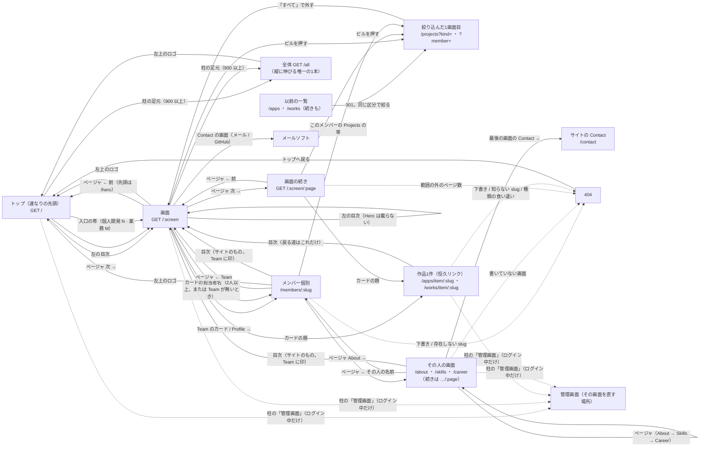
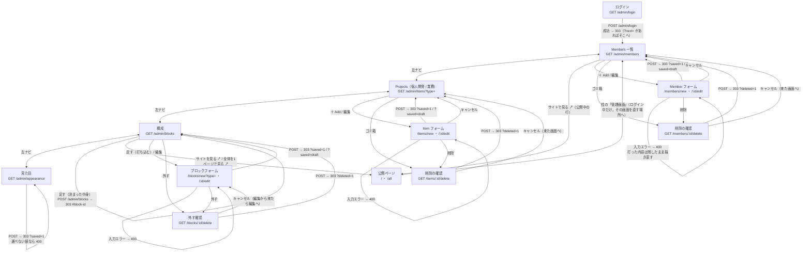
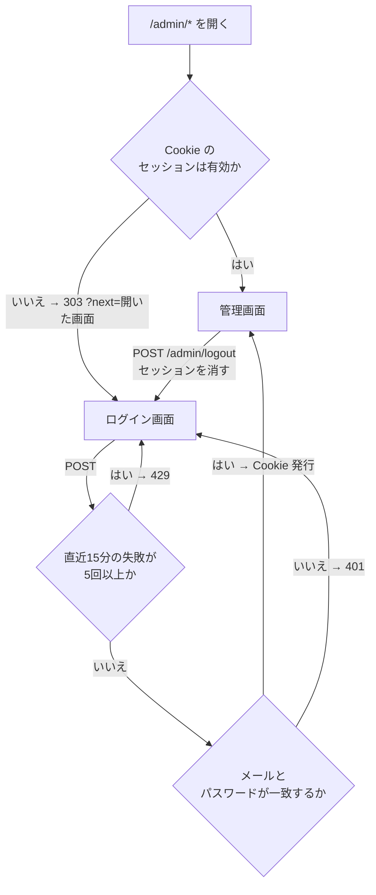
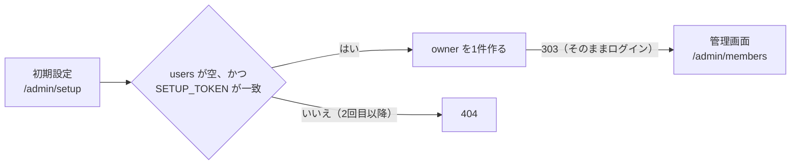

# 画面遷移図

GitHub 上でそのまま図として表示される（Mermaid）。画面の一覧は
[screens.md](./screens.md)。

## 公開側

公開ページは1画面に1つぶん。ページはスクロールせず、移動は普通のフルページ遷移で
やる。見る人は連なりをめくるか、目次で飛ぶか、カードから作品1件へ入るか、
Team のカードから個人ページへ入るかの4つだけ。個人ページも柱と目次はサイトのままで、
Team の続きとしてめくり、最後は Contact へ抜ける。

めくる先はページャ。数えるのは**節の中**（`Projects  2 / 4`）で、サイト全体の通し番号では
ない——全体で数えると、絞り込みが無関係な画面の番号まで動かす（[画面の一覧](screens.md)）。
節をまたぐ手だけが行き先を名乗る（`← 前` ではなく `← Projects`）。
`/projects/1` は `/projects` へ 303 で寄せる（同じ画面に URL を2つ作らない）。1画面しか
無いサイトではページャを出さない。目次には番号を振らない——数え上げはページャ1つに
寄せてある。画面の連なり（前後・目次・通し番号・canonical）は `src/lib/sequence.ts` が
1本で持っていて、トップも個人ページも同じところを通る。

絞り込み（区分・メンバー）は**ページを移る**。ピルはリンクで、
押すとそのブロックの1画面目へ遷移する——3画面目で絞り込むと、絞ったあとの
3画面目が無いことがあるため。絞り込みはページャにも目次にも同じ query が付いて
画面をまたいで効き、もう一度同じピルを押すとその軸だけ外れる（「すべて」は両方）。
公開ページは JavaScript を1バイトも持たないので、切っても何も変わらない。

作品1件のページ（`/apps/item/<slug>` ・ `/works/item/<slug>`）は**連なりの外にある1枚**。
ページャは出さず、戻る道は目次だけ（印は Projects に付く）。一覧のカードの題がここへの
リンクで、出る条件は「その作品が公開中」の1つだけ——Projects の節を外しても、
貼られたリンクは死なない。

個人開発と業務は、公開ページでは Projects の1つの一覧（新しい順）。以前の一覧の URL
（`/apps` `/works` とその続き）は、同じ区分で絞った `/projects` へ 301 で寄せる
（ページ数は引き継がない。区分を混ぜて並べ直したので、同じ番号に同じカードは居ない）。

「構成」で節を外しても、行き止まりを作らない。

- 帯（入口と個人ページの1枚目）は Projects へ送り、件数は区分ごとに数える
  （`個人開発 5 · 業務 2`。項目の無い区分は数えない）。Projects を外したサイトでは
  帯ごと出さない
- カードの担当者名（個人ページへのリンク）は、2人以上いるとき**か、Team を
  置いていないとき**に出す。Team が無いと、トップから個人ページへ行く道が
  ほかに1本も無い。作品1件のページの「担当」も同じ条件
- `?member=` は名前のピルが並ぶとき（2人以上）だけ効く。1人のサイトでは読まず、
  個人ページの帯も付けない。効かせると「すべて」にも名前にも印が付かないまま
  一覧だけが絞られる

全体ページ（`/all`）へは、柱の足元の「全体を1ページで見る ↗」から行く。899 以下では
足元ごと畳まれるので、スマホの幅では画面から消える（`sitemap.xml` には載る）。
管理画面の「構成」からも同じ1本が開く。印刷・Ctrl-F・翻訳・全体の点検のための
1本で、ここだけは縦に伸びる。詳しくは [screens.md](./screens.md#全体ページ)。

管理画面へは、**ログインしている人にだけ**柱に出る「管理画面」から行く（訪問者の
見た目は変わらない）。目次のすぐ後ろに置くので、899 以下の横帯でも右端に残る。
行き先は「いま見ている画面を直す場所」で、`src/routes/public.tsx` の `blockAdminPath`
が決める。

| 見ている画面 | 行き先 |
|---|---|
| 入口（Hero） | 1人のサイトならその人の編集、それ以外は Members 一覧 |
| Projects | 項目の一覧（`/admin/items`。個人開発 / 業務のタブ） |
| Team | Members 一覧 |
| Contact | 構成のその行（中身は `src/site.ts` にあり、管理画面からは変えられない） |
| 打ち込むブロック（ひとこと・メモ …） | そのブロックの編集 |
| 全体ページ（`/all`）・0件のトップ | 構成 |
| 作品1件 | その項目の編集 |
| 個人ページ（どの画面でも） | その人の編集 |

同じタブで開く（管理画面の「サイトを見る ↗」は別タブ。両方を別タブにすると、
直して見に行くたびにタブが増える）。

機械に読ませる `/robots.txt` と `/sitemap.xml` は、人の導線には出てこない。
どちらも Worker が公開ページと同じ式から組み立てる。

## 管理側

追加・編集・削除は、どれも「一覧 → フォーム → 一覧」で閉じる。削除だけ確認を挟む。

保存が必ず 303 リダイレクトで終わるので、リロードしても二重に登録されない。

左ナビの足元の「サイトを見る ↗」は、どの画面からも公開ページを別タブで開く。

下書きで保存したときは `?saved=draft` を返し、「下書きで保存しました。サイトには
まだ出ていません」と言い分ける。「保存しました」だけだと、サイトに出たと思われる。
書くブロック（ひとこと・数字 …）もメンバー・項目と同じく下書きから始める。

削除の確認は、来た画面へキャンセルで戻す。編集フォームの「削除」から来たときは
`?from=edit` が付いていて、キャンセルで編集フォームへ戻る（一覧へ飛ばすと、
直しかけていた行を探し直すことになる）。

構成の ↑↓ と「公開／下書き」は、行ごとの小さなフォーム。1回押すごとに1つ動いて
一覧に戻る。ドラッグ&ドロップにしないのは、JavaScript を増やさないため。
戻り先には `#block-<id>` を付け、触った行へ着地させる（行の枠がアクセント色になる）。
足したブロックは Contact の手前に入る——末尾に付けると締めの連絡先の後ろに
来てしまい、↑ を何度も押して運ぶことになる。

公開／下書きの切り替えと、「公開する」を外した保存は、中身の長さを検査しない。
検査すると、上限より前に保存された長い中身を持つ行が「引っ込めることすらできない」
行き止まりになる（残る手が本文ごと削除だけになる）。上限は公開するものに掛ける。

1行も無いうちは「足す」を出さない。0件のトップは既定の並びで描いているので、
先にそれを行にしてから触らせる。直接 `POST /admin/blocks` が来たときも、
足す前に既定の並びを行にする（足したのに5節が消える、を起こさないため）。

見た目だけは一覧を持たず、同じ画面に戻る。選ぶものが3つしかないので、
「どれを編集中か」を示す一覧が要らない。

## 認証

- ユーザーが居ないときも、必ず1回ハッシュを計算してから失敗を返す。応答の速さで
  アカウントの有無が分からないようにするため
- 失敗の回数は KV に 15 分の期限付きで置く。厳密な回数制限ではなく、総当たりを
  鈍らせるためのもの
- `POST` は Origin も確認する。ログイン・ログアウト・初期設定も対象
- ログインし直したら `?next=` の画面へ戻す。受け付けるのは `/admin/` の中だけで、
  外の URL・`//`・`..`・ログインやログアウト自身は捨てて `/admin/members` へ送る

## 初回だけ通る道

owner がまだ1人も居ないときだけ、この入口が開く。

`SETUP_TOKEN` は `wrangler secret put SETUP_TOKEN` で入れる。パスワードを
リポジトリに置かずに最初の1人を作るための仕掛けで、作った後は通らなくなる。
