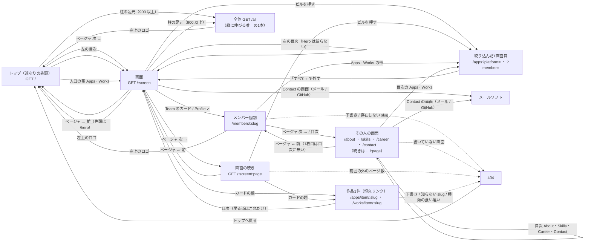
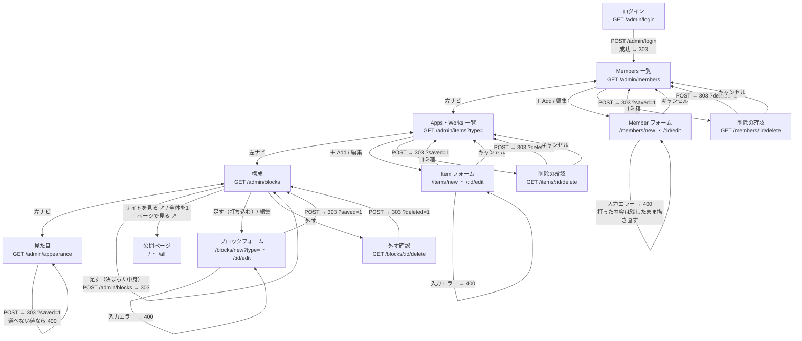
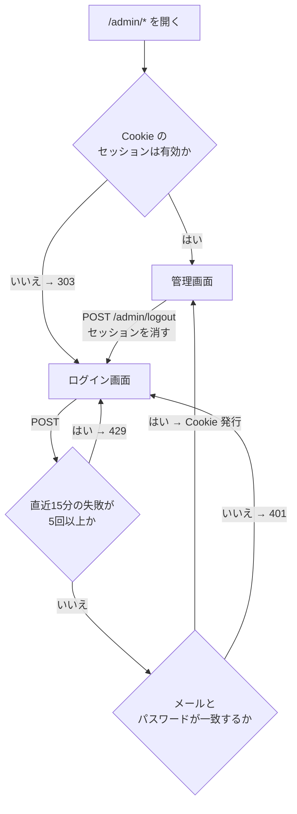
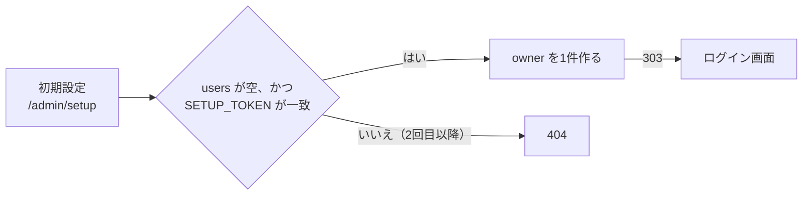

# 画面遷移図

GitHub 上でそのまま図として表示される（Mermaid）。画面の一覧は
[screens.md](./screens.md)。

## 公開側

公開ページは1画面に1つぶん。ページはスクロールせず、移動は普通のフルページ遷移で
やる。見る人は連なりをめくるか、目次で飛ぶか、カードから作品1件へ入るか、
個人ページへ抜けるかの4つだけ。

めくる先は `01 · 07` のページャ。`/apps/1` は `/apps` へ 303 で寄せる
（同じ画面に URL を2つ作らない）。1画面しか無いサイトではページャを出さない。
目次には番号を振らない——数え上げはページャ1つに寄せてある。画面の連なり
（前後・目次・通し番号・canonical）は `src/lib/sequence.ts` が1本で持っていて、
トップも個人ページも同じところを通る。

絞り込み（プラットフォーム・メンバー）は**ページを移る**。ピルはリンクで、
押すとそのブロックの1画面目へ遷移する——3画面目で絞り込むと、絞ったあとの
3画面目が無いことがあるため。絞り込みはページャにも目次にも同じ query が付いて
画面をまたいで効き、もう一度同じピルを押すとその軸だけ外れる（「すべて」は両方）。
公開ページは JavaScript を1バイトも持たないので、切っても何も変わらない。

作品1件のページ（`/apps/item/<slug>`）は**連なりの外にある1枚**。ページャは出さず、
戻る道は目次だけ。一覧のカードの題がここへのリンクで、出る条件は「その作品が
公開中」の1つだけ——Apps の節を外しても、貼られたリンクは死なない。

全体ページ（`/all`）へは、柱の足元の「全体を1ページで見る ↗」から行く。899 以下では
足元ごと畳まれるので、スマホの幅では画面から消える（`sitemap.xml` には載る）。
管理画面の「構成」からも同じ1本が開く。印刷・Ctrl-F・翻訳・全体の点検のための
1本で、ここだけは縦に伸びる。詳しくは [screens.md](./screens.md#全体ページ)。

機械に読ませる `/robots.txt` と `/sitemap.xml` は、人の導線には出てこない。
どちらも Worker が公開ページと同じ式から組み立てる。

## 管理側

追加・編集・削除は、どれも「一覧 → フォーム → 一覧」で閉じる。削除だけ確認を挟む。

保存が必ず 303 リダイレクトで終わるので、リロードしても二重に登録されない。

構成の ↑↓ と「公開／下書き」は、行ごとの小さなフォーム。1回押すごとに1つ動いて
一覧に戻る。ドラッグ&ドロップにしないのは、JavaScript を増やさないため。

公開／下書きの切り替えと、「公開する」を外した保存は、中身の長さを検査しない。
検査すると、上限より前に保存された長い中身を持つ行が「引っ込めることすらできない」
行き止まりになる（残る手が本文ごと削除だけになる）。上限は公開するものに掛ける。

1行も無いうちは「足す」を出さない。0件のトップは既定の並びで描いているので、
先にそれを行にしてから触らせる。直接 `POST /admin/blocks` が来たときも、
足す前に既定の並びを行にする（足したのに5節が消える、を起こさないため）。

見た目だけは一覧を持たず、同じ画面に戻る。選ぶものが3つしかないので、
「どれを編集中か」を示す一覧が要らない。

## 認証

- ユーザーが居ないときも、必ず1回ハッシュを計算してから失敗を返す。応答の速さで
  アカウントの有無が分からないようにするため
- 失敗の回数は KV に 15 分の期限付きで置く。厳密な回数制限ではなく、総当たりを
  鈍らせるためのもの
- `POST` は Origin も確認する。ログイン・ログアウト・初期設定も対象

## 初回だけ通る道

owner がまだ1人も居ないときだけ、この入口が開く。

`SETUP_TOKEN` は `wrangler secret put SETUP_TOKEN` で入れる。パスワードを
リポジトリに置かずに最初の1人を作るための仕掛けで、作った後は通らなくなる。
