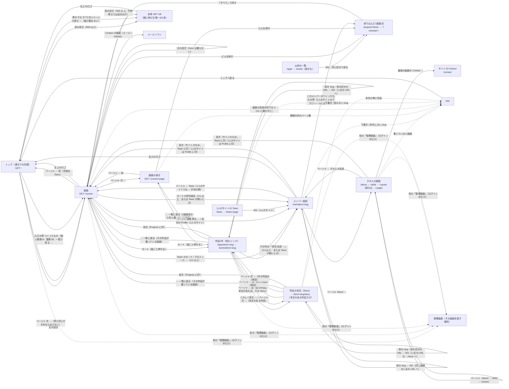
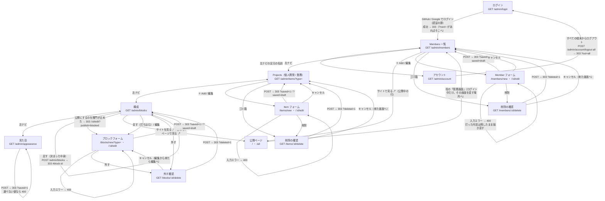
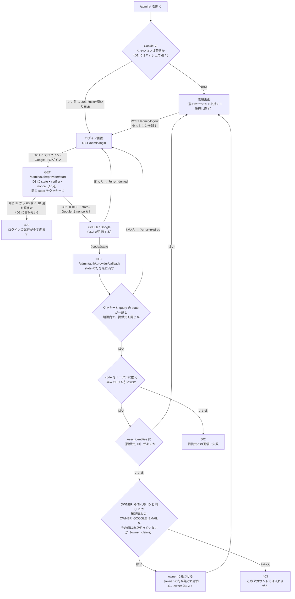
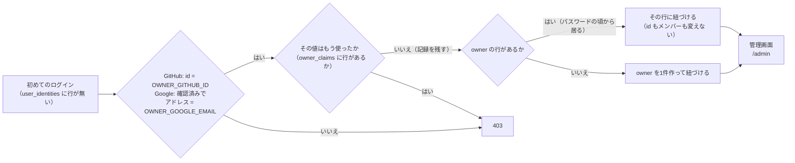

# 画面遷移図

GitHub 上でそのまま図として表示される（Mermaid）。画面の一覧は
[screens.md](./screens.md)。

## 公開側

公開ページは1画面に1つぶん。ページはスクロールせず、移動は普通のフルページ遷移で
やる。見る人は連なりをめくるか、目次で飛ぶか、カードから作品1件へ入るか、
Team のカードから個人ページへ入るかの4つだけ。個人ページも柱と目次はサイトのまま。

個人ページへの入り方は人数で変わる。

- **1人のサイト（Team を置いているとき）**: Team の画面は無い。その位置にその人の画面
  （1枚目 → About → Skills → Career）がサイトの連なりとして並ぶので、入口から「次」を
  押し続けるだけで着き、そのまま Contact へ抜ける。目次では「Profile」の1行。
  `/team` は1枚目へ 301
- **2人以上のサイト**: Team のカードから入り、Team の続きとしてめくり、最後は Contact へ
  抜ける（Team の画面自身の「次」は Contact のまま）

下の図は両方の形を1枚に載せ、片方にしか無い矢印には（2人以上）（1人のサイト）と
添えてある。1人のサイトでは Team のカードが無く、`Screen`（Projects）から `Profile` へは
ページャの「岡崎 昂功 →」か目次の「Profile」で入る。

めくる先はページャ。数えるのは**節の中**（`Projects  2 / 4`）で、サイト全体の通し番号では
ない——全体で数えると、絞り込みが無関係な画面の番号まで動かす（[画面の一覧](screens.md)）。
節をまたぐ手だけが行き先を名乗る（`← 前` ではなく `← Projects`）。
`/projects/1` は `/projects` へ 303 で寄せる（同じ画面に URL を2つ作らない）。1画面しか
無いサイトではページャを出さない。入口（連なりの先頭の Hero）も、帯の行き先がページャの
「次」と同じなら出さない——同じ `/projects` へのリンクを2つ置かない。入口から先へ進む手は
帯になる（入口と Projects の間に画面を置いた構成では、ページャはそちらへ、帯は一覧へ）。目次には番号を振らない——数え上げはページャ1つに
寄せてある。画面の連なり（前後・目次・通し番号・canonical）は `src/lib/sequence.ts` が
1本で持っていて、トップも個人ページも同じところを通る。

絞り込み（区分・メンバー）は**ページを移る**。ピルはリンクで、
押すとそのブロックの1画面目へ遷移する——3画面目で絞り込むと、絞ったあとの
3画面目が無いことがあるため。絞り込みはページャにも目次にも同じ query が付いて
画面をまたいで効き、もう一度同じピルを押すとその軸だけ外れる（「すべて」は両方）。
公開ページは JavaScript を1バイトも持たないので、切っても何も変わらない。

作品1件のページ（`/apps/item/<slug>` ・ `/works/item/<slug>`）は**作品同士でめくる、
自分たちだけの連なり**。ページャは一覧と同じ並びで前後の作品へ行き（`← 前`
`Projects 3 / 7` `次 →`。恒久リンクの無い作品は飛ばす）、サイトの連なりには継がない。
中身はカードを開いたもので、画像（あれば）はここにだけ出る。本文を書いた作品は、
1枚目の次に本文だけの画面（Story、`…/<slug>/story`）を持ち、1枚目 → Story → 次の作品と
めくる。入口は1枚目の説明のすぐ下の「くわしく読む →」とページャの「次 →」。ページャが
数えるのは作品なので、Story でも `Projects 3 / 7` のまま（同じ作品の2枚目）。
どちらの画面も頭の「← 一覧に戻る」は、その作品が載っている Projects の画面（`/projects/N`）へ
戻す——目次の Projects は1画面目へ行くので、4画面目から入った人が最初からめくり直さずに
済む。目次の印は Projects に付く。一覧のカードは面ごとここへのリンクで（中の Repository と
担当者名はそれぞれの行き先へ。カードの行き先は 600 未満と、900 以上の画像のある行では
畳むので、そこでは作品のページの行き先から出る）、出る条件は「その作品が公開中」の1つだけ——Projects の
節を外しても、貼られたリンクは死なない（そのときは「← 一覧に戻る」を出さない）。
管理画面で slug を変えた作品・メンバーの前の URL と、区分を変えた作品の前の区分の URL は、
いまの URL へ 301 で寄せる（前の slug は `item_slug_redirects` / `member_slug_redirects`
に残っている）。変えた日に名刺や SNS に貼ったリンクが切れる、を起こさない。
この 301（と1人のサイトの `/team`・個人ページの Contact の 301）は行き先がデータで
変わるので、`Cache-Control: no-cache` でブラウザに覚えさせない——slug を元に戻した
日に、前の転送を覚えたブラウザがリダイレクトの無限ループにならないように。

個人開発と業務は、公開ページでは Projects の1つの一覧（新しい順）。以前の一覧の URL
（`/apps` `/works` とその続き）は、同じ区分で絞った `/projects` へ 301 で寄せる
（ページ数は引き継がない。区分を混ぜて並べ直したので、同じ番号に同じカードは居ない）。

「構成」で節を外しても、行き止まりを作らない。

- 帯（入口と個人ページの1枚目）は Projects へ送り、件数は区分ごとに数える
  （`個人開発 5 · 業務 2`。項目の無い区分は数えない）。Projects を外したサイトでは
  帯ごと出さない
- カードの担当者名（個人ページへのリンク）は、2人以上いるとき**か、Team を
  置いていないとき**に出す。Team が無いと、トップから個人ページへ行く道が
  ほかに1本も無い。作品1件のページの「担当」も同じ条件
- `?member=` は名前のピルが並ぶとき（2人以上）だけ効く。1人のサイトでは読まず、
  個人ページの帯も付けない。効かせると「すべて」にも名前にも印が付かないまま
  一覧だけが絞られる

全体ページ（`/all`）へは、柱の足元の「全体を1ページで見る →」と、入口の帯の下の
「すべてを1ページで読む →」から行く。足元は 899 以下で畳まれるので、スマホの幅では
入口の1本が受ける（`sitemap.xml` にも載る）。中央寄せの骨格の 900 以上では、足元の
著作権表示は出さず、全体ページへの1本だけを目次と同じ行に置く。
管理画面の「構成」からも同じ行き先が開く。印刷・Ctrl-F・翻訳・全体の点検のための
1本で、ここだけは縦に伸びる。詳しくは [screens.md](./screens.md#全体ページ)。

管理画面へは、**ログインしている人にだけ**柱に出る「管理画面」から行く（訪問者の
見た目は変わらない）。目次のすぐ後ろに置くので、899 以下の横帯でも右端に残る。
行き先は「いま見ている画面を直す場所」で、`src/routes/public/page.tsx` の `blockAdminPath`
が決める。

| 見ている画面 | 行き先 |
|---|---|
| 入口（Hero） | 1人のサイトならその人の編集、それ以外は Members 一覧 |
| Projects | 項目の一覧（`/admin/items`。個人開発 / 業務のタブ） |
| Team（2人以上のサイト） | Members 一覧 |
| Contact | 構成のその行（中身は `src/site.ts` にあり、管理画面からは変えられない） |
| 打ち込むブロック（ひとこと・メモ …） | そのブロックの編集 |
| 全体ページ（`/all`）・0件のトップ | 構成 |
| 作品1件（1枚目・本文の画面 Story） | その項目の編集 |
| 個人ページ（どの画面でも。1人のサイトのプロフィールも） | その人の編集 |

同じタブで開く（管理画面の「サイトを見る ↗」は別タブ。両方を別タブにすると、
直して見に行くたびにタブが増える）。

機械に読ませる `/robots.txt` と `/sitemap.xml` は、人の導線には出てこない。
どちらも Worker が公開ページと同じ式から組み立てる。

## 管理側

追加・編集・削除は、どれも「一覧 → フォーム → 一覧」で閉じる。削除だけ確認を挟む。

保存が必ず 303 リダイレクトで終わるので、リロードしても二重に登録されない。
送信ボタンの2度押し（遅い回線・送り直し）は、追加のフォームが描くときに持つ
一度きりの札（`formKey`）で止める——同じ札の2度目は新しい行を作らず、1度目がその札で
作った行への保存になる（編集と同じ道。中身が同じなら書き直すだけ、「戻る」で開き直して
直した・公開に印を付けたなら、それを反映して公開の関門も通す。知らせは
「1度目に作ったものに書きました」まで言う）。JavaScript が無いので、押したあとにボタンを押せなくする
手が無い。「この並びから始める」は1文の INSERT で、決まった中身のブロックは DB の
部分一意索引で、同時に来た2本目を止める。

左ナビの足元の「サイトを見る ↗」は、どの画面からも公開ページを別タブで開く。

下書きで保存したときは `?saved=draft` を返し、「下書きで保存しました。サイトには
まだ出ていません」と言い分ける。「保存しました」だけだと、サイトに出たと思われる。
書くブロック（ひとこと・数字 …）もメンバー・項目と同じく下書きから始める。

削除の確認は、来た画面へキャンセルで戻す。編集フォームの「削除」から来たときは
`?from=edit` が付いていて、キャンセルで編集フォームへ戻る（一覧へ飛ばすと、
直しかけていた行を探し直すことになる）。

構成の ↑↓ と「公開／下書き」は、行ごとの小さなフォーム。1回押すごとに1つ動いて
一覧に戻る。ドラッグ&ドロップにしないのは、JavaScript を増やさないため。
戻り先には `#block-<id>` を付け、触った行へ着地させる（行の枠がアクセント色になる）。
足したブロックは Contact の手前に入る——末尾に付けると締めの連絡先の後ろに
来てしまい、↑ を何度も押して運ぶことになる。

**公開の関門は「published が 1 になるとき」に1か所**（`src/blocks.ts` の
`publishErrors`）。ブロックを新しく書く・編集で公開にする・構成の一覧の「公開する」・
作品の保存・メンバーの保存が、どれも同じ関数を通る。一覧の「公開する」が止められたら、
303 でその行の編集画面へ送り（`?publish=blocked`）、理由と「公開する」の印を付けて描く
——直して保存すれば公開になる。

下書きに戻す方向（一覧の「下書きにする」と、「公開する」を外した保存）は、中身の長さを
検査しない。検査すると、上限より前に保存された長い中身を持つ行が「引っ込めることすら
できない」行き止まりになる（残る手が本文ごと削除だけになる）。上限は公開するものに掛ける
（以前はメンバーの紹介文だけが下書きでも長さを見ていて、その行き止まりが残っていた）。

長さではなく**値そのもの**が受け取れないものは、下書きの保存でも 400 で止める——
画像（中身が PNG・JPEG・WebP・AVIF・GIF のどれでもない、1MB を超える）と、URL
（作品のリンクの `javascript:`・頭を省いた相対 URL・ラベルか URL の片方だけの行、
メンバーの GitHub の `https://` 以外、リンク集の落ちる行）と、書くブロックの空の中身と、
数として読めない並び順（全角の数字は読む）と、消えた担当メンバー・プラットフォーム。
どれも公開ページが落とすか、DB が受け取れないもので、直すのは同じフォームの中で済む
（リンクとリンク集は何行目かを言う）。画像を選んで別の欄で止められたときは
「画像はまだ保存していません」と添える。

作品の保存は、行・タグ・リンク・転送表を**1つの batch**で書く（全部書けるか何も
書かない）。1本ずつ書いていたころは、タグを 34 個付けると D1 の束縛変数の上限で
途中の INSERT が落ち、前のタグとリンクはもう消えていた。

画像のある保存は、検査が全部通ってから KV に置き、そのあと D1 を書く。D1 で
落ちたら置いた画像を消してから 500 を返す（どの行からも指されない画像を残さない）。
差し替えた前の画像を消すのは、D1 が通ったあと。

ログインした POST は、終わったあとで公開ページの写しの版（KV の `site:version`）を
上げる（`src/lib/page-cache.ts` の `touchSiteOnWrite`）。上げないのは 4xx で止めた保存
だけ。訪問者の画面が新しくなるのは、ほかの場所では版の読みのキャッシュが切れる
最大 60 秒ほどあと。保存した本人はクッキーで写しを通らないので、公開ページへ
行けばすぐ新しい画面が出る。

1行も無いうちは「足す」を出さない。0件のトップは既定の並びで描いているので、
先にそれを行にしてから触らせる。直接 `POST /admin/blocks` が来たときも、
足す前に既定の並びを行にする（足したのに4節が消える、を起こさないため）。

見た目だけは一覧を持たず、同じ画面に戻る。選ぶものが3つしかないので、
「どれを編集中か」を示す一覧が要らない。

## 認証

ログインは GitHub / Google の OAuth だけ（パスワードは無い）。ログイン画面の2つは
フォームではなく GET のリンクで、往復は `/admin/auth/:provider/start` と `callback`。

- 本人は提供元の ID で照合する（GitHub は数値の id、Google は sub）。ログイン名や
  メールアドレスを見るのは、最初の紐づけのときだけ
- ログインの入口は、同じ IP から 60 秒に 10 回まで（Workers の Rate Limiting）。
  超えたぶんは D1 に書かずに 429
- state は D1 で1回きり。成功しても弾いても、差し出された札（クッキーの側と
  query の側）はその場で消える。同じ URL をもう一度開いてもやり直しになる
- Google の id_token は iss・aud・exp・nonce を確かめ、合わなければ 400。署名は、
  トークンエンドポイントから TLS で直接受け取ったものなので確かめない（OIDC Core 3.1.3.7）
- アクセストークンは本人の ID を引いたら捨てる。保存しない・ログに出さない
- `POST` は送り元も確認する（Origin → Sec-Fetch-Site → Referer。`Origin: null` は 403）。
  ログアウトも対象
- ログインし直したら `?next=` の画面へ戻す。受け付けるのは `/admin/` の中だけで、
  外の URL・`//`・`..`・ログインの往復やログアウト自身は捨てて `/admin` へ送る

## 最初の紐づけ

最初の owner を作る入口（`/admin/setup`）は無い。`wrangler.toml` の `[vars]` と
一致するアカウントで初めてログインしたとき、そのアカウントが owner に紐づく。
`[vars]` の値が効くのは値ごとに1度だけ（使った値は `owner_claims` に残る）。

GitHub と Google の両方を、同じ owner に紐づけられる（片方で入ったあと、もう片方でも
一度ログインする。同時に初めて入っても owner は1人——部分一意索引 `users_one_owner`）。
紐づいたあとは `[vars]` を書き換えても外れない。外すのは `user_identities` の行を
消すこと（README の「管理画面に入る」）。外したアカウントは、同じアカウントで入り直しても
紐づき直らない（その値はもう使ってある）。また使うときは `owner_claims` の行も消す。
同じ確認済みのアドレスを持つ別の Google アカウント（別の sub）も、同じ値では紐づかない。
