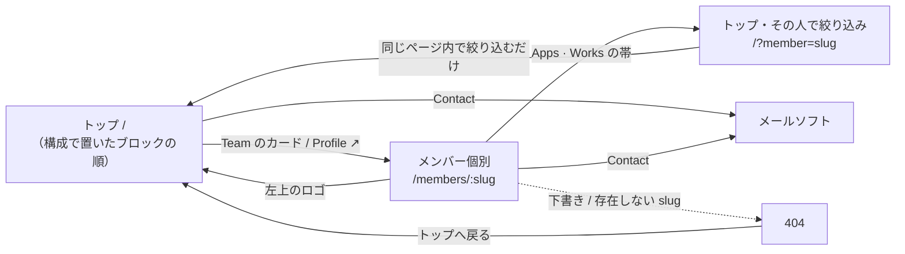
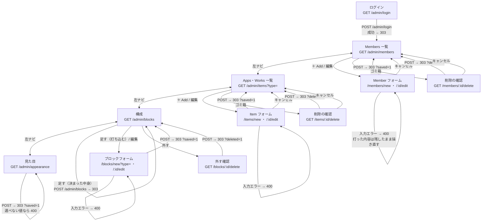
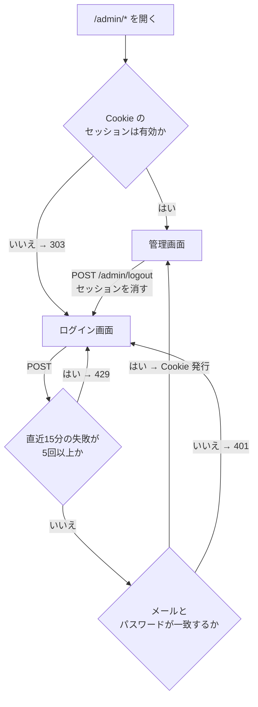
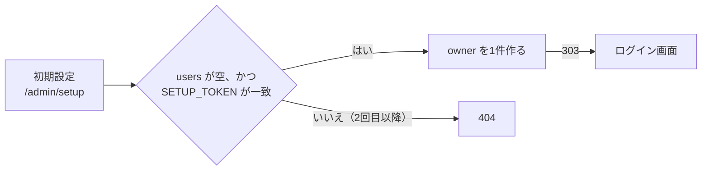

# 画面遷移図

GitHub 上でそのまま図として表示される（Mermaid）。画面の一覧は
[screens.md](./screens.md)。

## 公開側

見る人の動きは短い。トップから個人ページへ行き、戻ってくるだけ。

Apps の絞り込み（プラットフォーム・メンバー）はページを移らない。`filter.js`
が同じページのカードを出し入れするだけで、JavaScript を切れば全件が出る。

## 管理側

追加・編集・削除は、どれも「一覧 → フォーム → 一覧」で閉じる。削除だけ確認を挟む。

保存が必ず 303 リダイレクトで終わるので、リロードしても二重に登録されない。

構成の ↑↓ は、行ごとの小さなフォーム。1回押すごとに1つ動いて一覧に戻る。
ドラッグ&ドロップにしないのは、JavaScript を増やさないため。

1行も無いうちは「足す」を出さない。0件のトップは既定の並びで描いているので、
先にそれを行にしてから触らせる。直接 `POST /admin/blocks` が来たときも、
足す前に既定の並びを行にする（足したのに5節が消える、を起こさないため）。

見た目だけは一覧を持たず、同じ画面に戻る。選ぶものが3つしかないので、
「どれを編集中か」を示す一覧が要らない。

## 認証

- ユーザーが居ないときも、必ず1回ハッシュを計算してから失敗を返す。応答の速さで
  アカウントの有無が分からないようにするため
- 失敗の回数は KV に 15 分の期限付きで置く。厳密な回数制限ではなく、総当たりを
  鈍らせるためのもの
- `POST` は Origin も確認する。ログイン・ログアウト・初期設定も対象

## 初回だけ通る道

owner がまだ1人も居ないときだけ、この入口が開く。

`SETUP_TOKEN` は `wrangler secret put SETUP_TOKEN` で入れる。パスワードを
リポジトリに置かずに最初の1人を作るための仕掛けで、作った後は通らなくなる。
